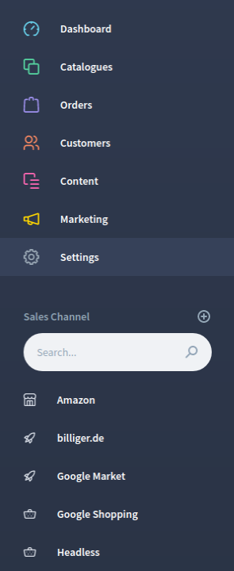
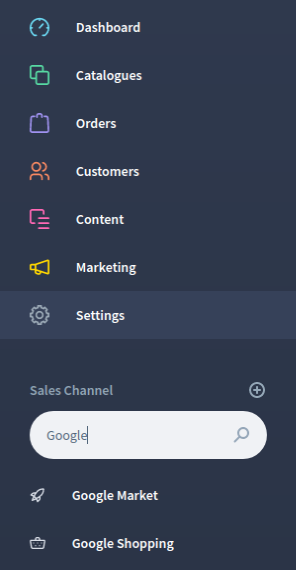

# FroshAdminSalesChannelSearch

Adds a search input field to the administration's navigation, which allows searching for sales channels, if there are more than 5.

## Requirements

- Shopware 6.4 or higher

## Screenshots

 

# Installation

## ZIP installation package for the Shopware Plugin Manager

* Download the latest plugin version (e.g. `FroshAdminSalesChannelSearch-0.1.0.zip`)
* Upload and install plugin using Plugin Manager

## Install with composer

* Change to your root Installation of shopware
* Run command `composer require frosh/admin-sales-channel-search` and install and active plugin with Plugin Manager 
